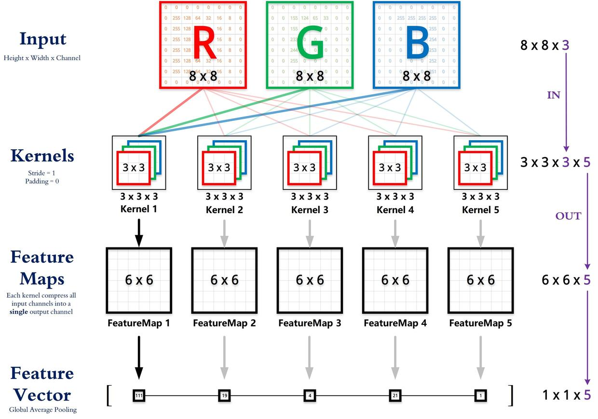

## This is a note about CNN

* The operation of Convolution 
>The input channel of filter equals the picture channel. When one filter finished scanning a picture, it will produce a feature map.[1]

### Reference
1. [Multi-channel image convolution process and calculation method](https://blog.csdn.net/briblue/article/details/83063170)
2. [The input and output of convolution](https://www.cnblogs.com/chumingqian/articles/11495364.html)